<div align="center">

# The VI House

**A private, invitation-first community for founders, investors and operators.**<br>
Curated experiences, member sessions, a journal, and an admin panel to run it all, in four languages.

[thevihouse.com](https://thevihouse.com) · [Run it locally](#run-it-locally) · [Contributing](CONTRIBUTING.md)

[](https://github.com/mert-turkgil/The_VI_House/actions/workflows/ci.yml)


<br>

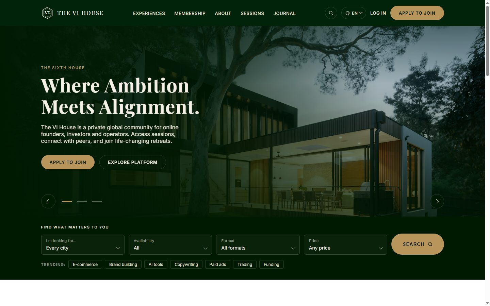

</div>

---

## What it is

The VI House is a complete membership platform, not a template. People apply to an experience, such as a founder weekend in Miami or a growth mastermind in London. Every application is reviewed by a person. Approved applicants get a private payment link, become members, and get access to sessions, recordings and the community.

The project includes everything around that flow: Stripe checkout and subscriptions, an influencer programme with its own dashboard, a journal with an editorial workflow, two-step verification, and an admin panel that edits every text on the site live in English, German, Turkish and Estonian.

<table>
  <tr>
    <td width="50%">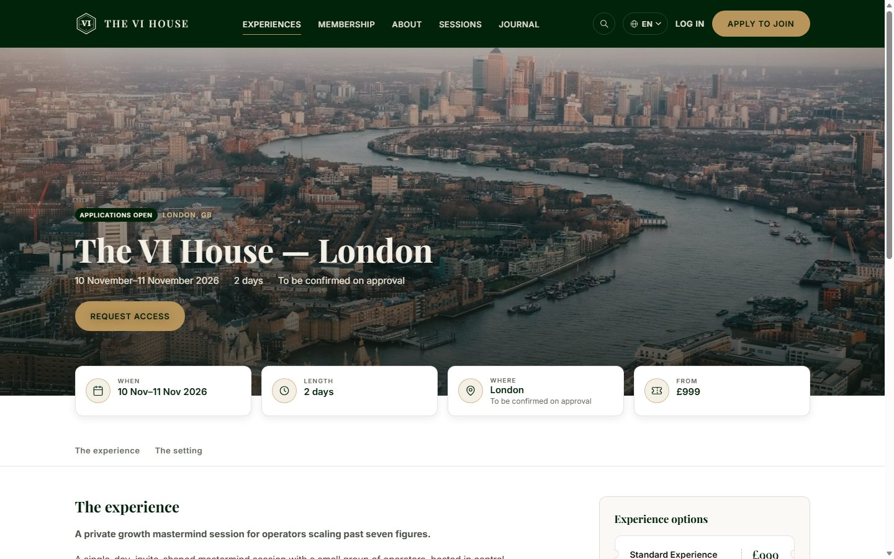<br><sub><b>Experiences.</b> Each experience has its own page with dates, a location and ticket options. Apply, join the waitlist, or follow it until it opens.</sub></td>
    <td width="50%">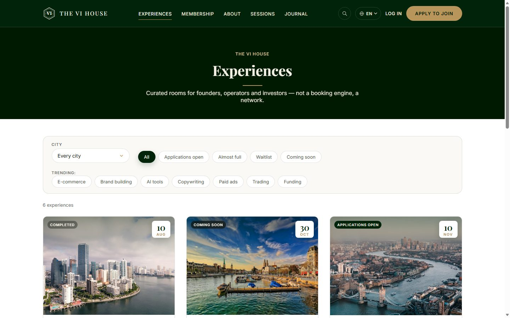<br><sub><b>Browse</b> by city, status and topic.</sub></td>
  </tr>
  <tr>
    <td>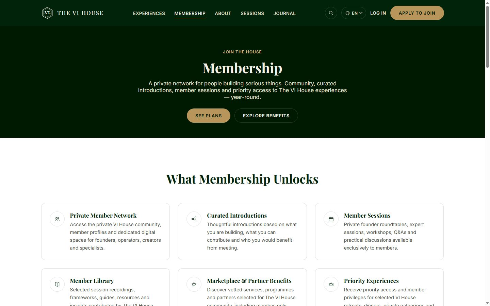<br><sub><b>Membership.</b> Plans are kept in sync with Stripe Products and Prices.</sub></td>
    <td>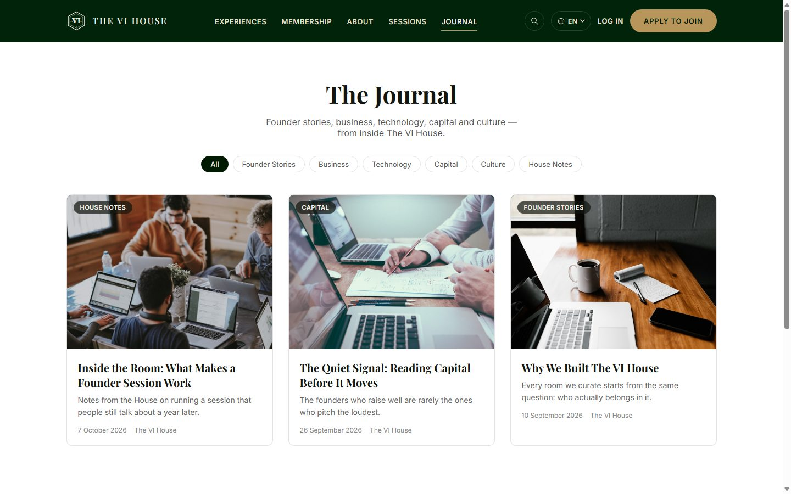<br><sub><b>The Journal.</b> Long-form articles with categories, cover images and video embeds.</sub></td>
  </tr>
  <tr>
    <td>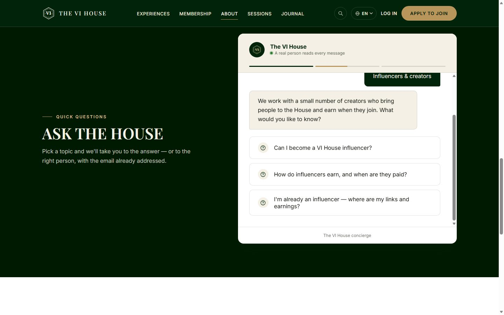<br><sub><b>Ask the House.</b> A guided chat that answers common questions, or opens an email to the right person.</sub></td>
    <td>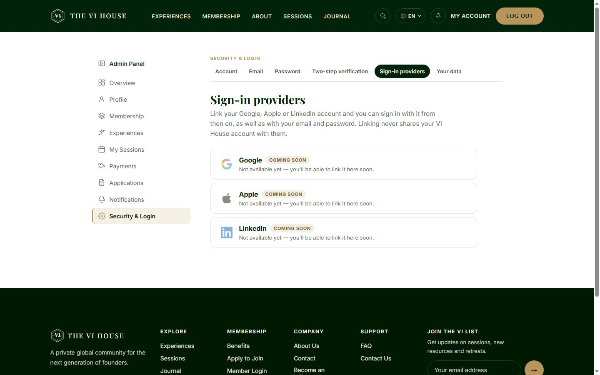<br><sub><b>Security.</b> Two-step verification, and Google, Apple and LinkedIn sign-in for accounts that have linked them.</sub></td>
  </tr>
</table>

<p align="center">
  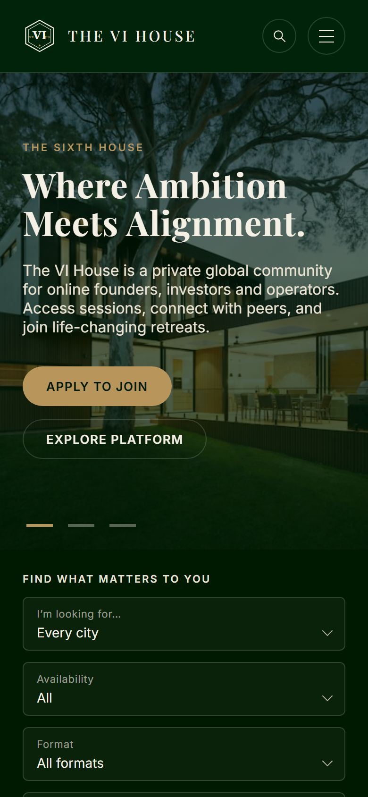
  &nbsp;&nbsp;
  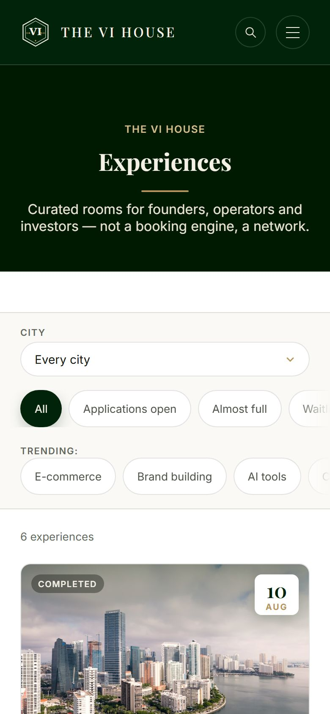
  <br><sub>Built for phones first. Every page is tested at 390&nbsp;px.</sub>
</p>

## The admin panel

<table>
  <tr>
    <td width="50%">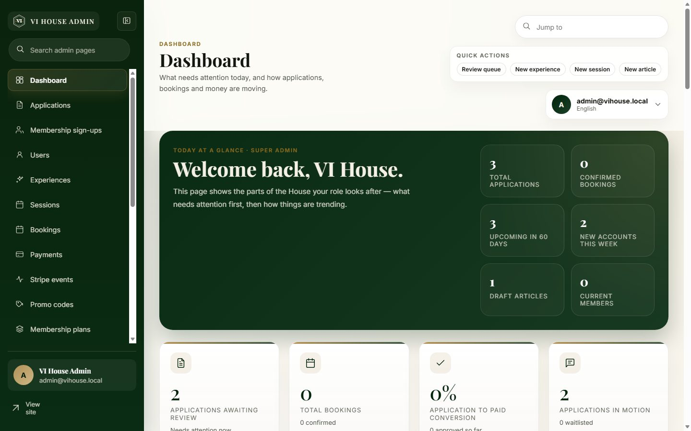<br><sub><b>Dashboard.</b> What needs attention today. Each role sees the sections it works with.</sub></td>
    <td width="50%">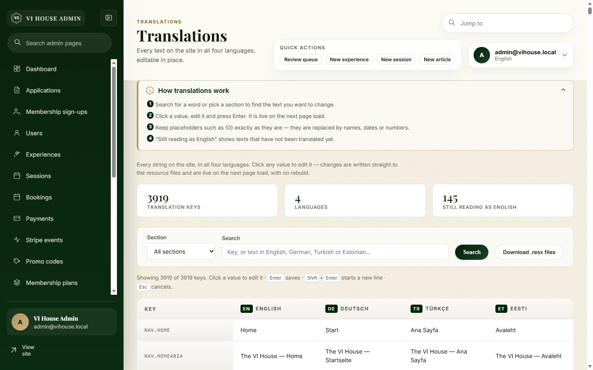<br><sub><b>Translations.</b> Edit about 3,900 texts in four languages. Changes are live on the next page load, with no rebuild.</sub></td>
  </tr>
  <tr>
    <td colspan="2">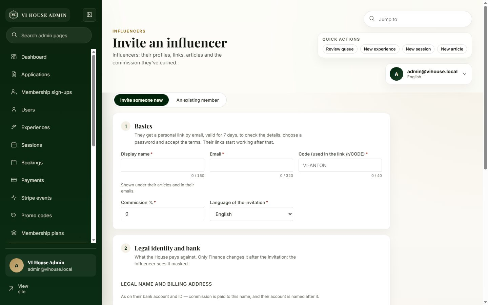<br><sub><b>Influencers.</b> Invite a new person by email or promote an existing member. Each influencer gets referral links and QR codes, a commission ledger, withdrawal requests, and journal submissions that the editors review.</sub></td>
  </tr>
</table>

## Features

**For visitors and members**
- Applications reviewed by a person, a waitlist, and private time-limited payment links
- Stripe Checkout (including Apple Pay), subscriptions, renewals, refunds and promo codes
- Sessions with sign-up, members-only articles and recordings
- A member directory, community links (Discord, broadcasts, recurring calls) and a founder programme with badges and perks
- A Coming Soon page with a launch list, and "tell me when it opens" on empty sections
- Site search, SEO metadata, a sitemap and `llms.txt`

**For influencers**
- An invite-only programme with personal `/r/CODE` links and QR codes for every experience and session
- A personal dashboard: visits, purchases, commission, and withdrawal requests paid by bank transfer
- A writer for journal articles with review by the editors, and an author box under each published article

**For the team**
- A role-based admin panel (SuperAdmin, Editor, Event Manager, Marketing, Finance, Concierge, Support) with an audit log
- Email and SMS logs with resend, Stripe event inspection, and a site and SEO settings page
- Four languages everywhere: the site, the admin panel and the emails

## Tech stack

| Layer | Technology |
|---|---|
| Web | ASP.NET Core 10 MVC with Razor Pages (Identity) |
| Data | Entity Framework Core 10 on SQL Server |
| Front end | TypeScript, SCSS and Vite. No front-end framework; the pages are rendered on the server. |
| Payments | Stripe (Checkout, Billing, webhooks) |
| Auth | ASP.NET Core Identity, TOTP two-step verification, Google, Apple, LinkedIn (OpenID Connect) |
| Editor and images | CKEditor 5, ImageSharp |
| CI/CD | GitHub Actions: build and tests on every pull request; deploy to production after approval |

```
src/
├── VIHouse.Entities     domain model
├── VIHouse.DataAccess   EF Core context, migrations, seed data, Identity
├── VIHouse.Business     services, Stripe/email/SMS integrations, options
└── VIHouse.WebUI        MVC site, admin area, Identity pages, ClientApp (Vite)
tests/VIHouse.Tests
```

## Run it locally

You don't need any of the project's keys. On a fresh clone in Development, the app uses a local database, a demo admin and demo content.

```sh
git clone https://github.com/mert-turkgil/The_VI_House.git
cd The_VI_House/src/VIHouse.WebUI
dotnet run --launch-profile http
```

Open http://localhost:5062 and sign in as `admin@vihouse.local` with the password `VIHouse-Dev-Admin-1!`.

You need the .NET 10 SDK, Node.js 22 and SQL Server. On Windows, LocalDB is enough; on macOS and Linux, use Docker. [CONTRIBUTING.md](CONTRIBUTING.md) covers the database options, how to load the site photography, and which features stay off until you add your own test keys.

## Contributing

Issues and pull requests are welcome. Fork the repository, create a branch from `master`, and open a pull request; CI builds and tests it automatically. Please read [CONTRIBUTING.md](CONTRIBUTING.md) first. It is short.

<div align="center"><sub>Made with care in four languages.</sub></div>
